# Simplify

Simplify is a website that aims to provide users with a simple and interactive to do list that can adapt to the users needs and organization. 

A live link to the website can be found here [Simplify] (https://dregan-dev.github.io/you-kan-do-it/)

## Site Owner Goals 
- To provide the user with a website that is easy to navigate and fully responsive
- To provide the user with everything they would need to set up a list of reminders, a daily to do list or a task manager for larger projects.

## User Stories 

### First Time User
- As a first time user, I want to easily understand the main purpose of the website and quickly be able to start organizing my tasks
- As a first time user, I want to be able to navigate the website easily and have a positive emotional response to it's design and usability

### Frequent User
- As a frequent user, I want to be able to access a quick and easy task organization tool that is reliable and well designed
- I want to be able to interact with my tasks in such a way that i can create, read, update and delete tasks as needed

## Design 

### Imagery 
The use of imagery on the simplify website is very minimal and used only to give the sense of calm as the user begins to organize their tasks.

### Colors
The colors used in this website were selected based on the hero image and the colors therein. A sixties/seventies movie credits style was captured on the hero image and was implemented through out the Kanban boards appropriately. 

### Fonts 
'Play' was used for the logo and text througout the website due to its formal but yet relaxed appearance.

### Wireframes 

  
Desktop Wireframe

  
  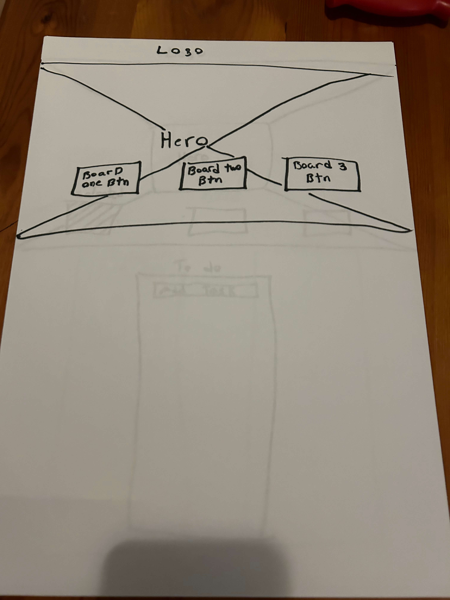
  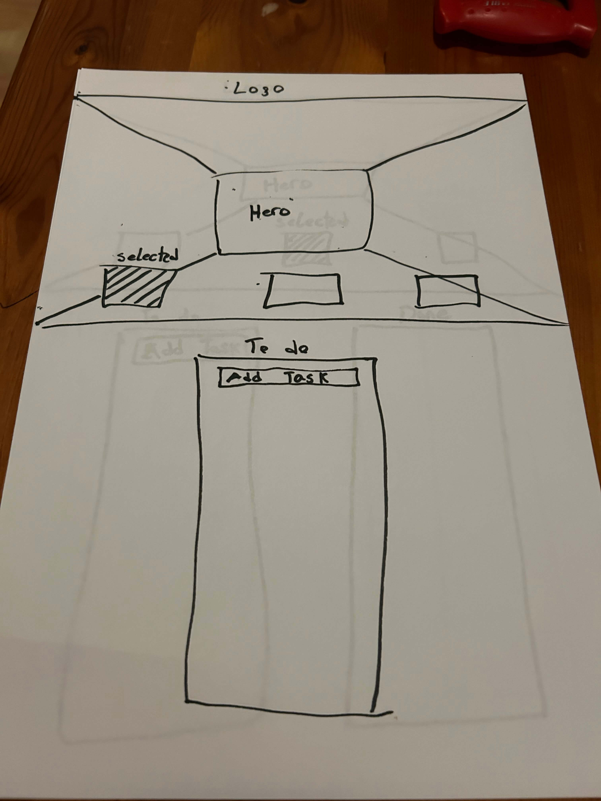
  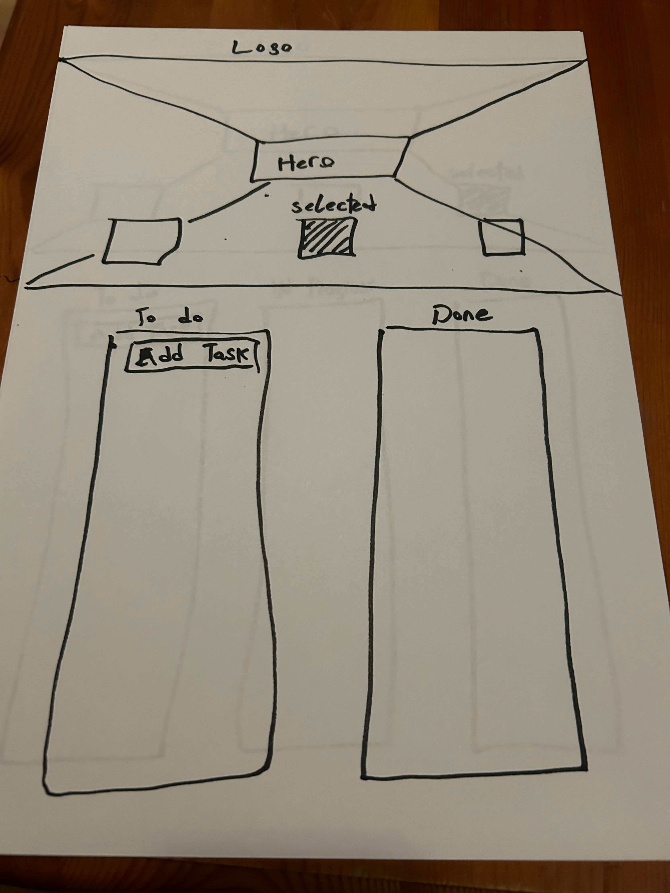
  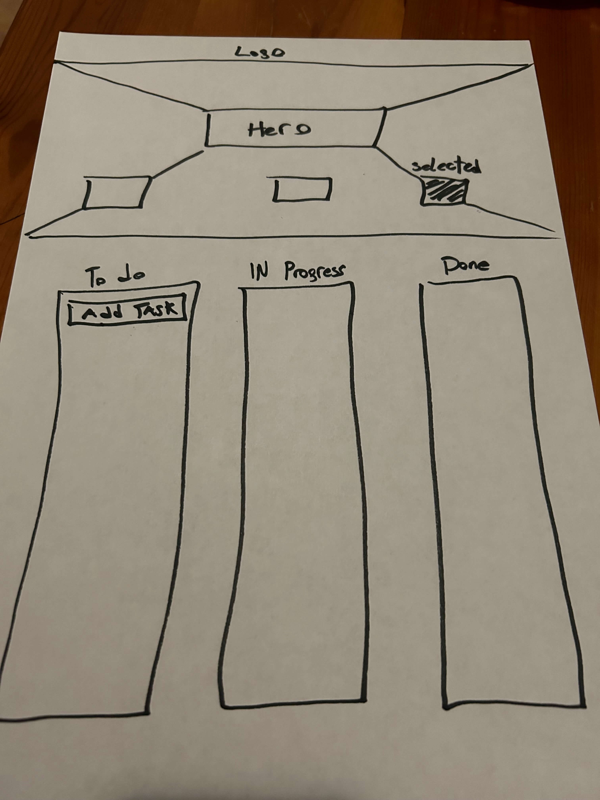

  
Mobile Wireframes

  
  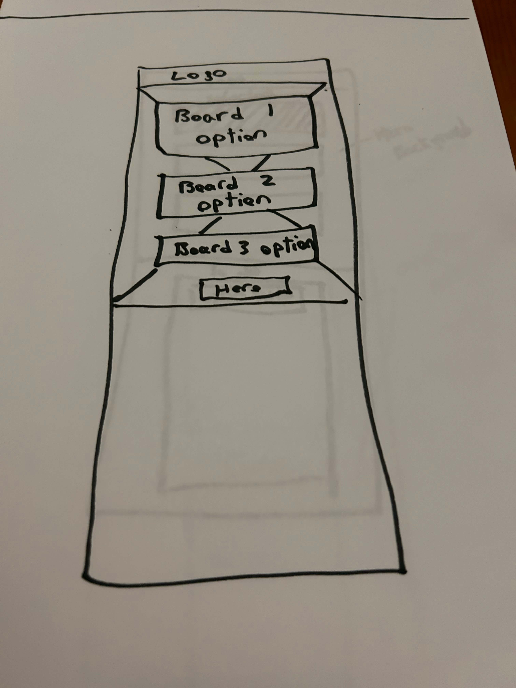
  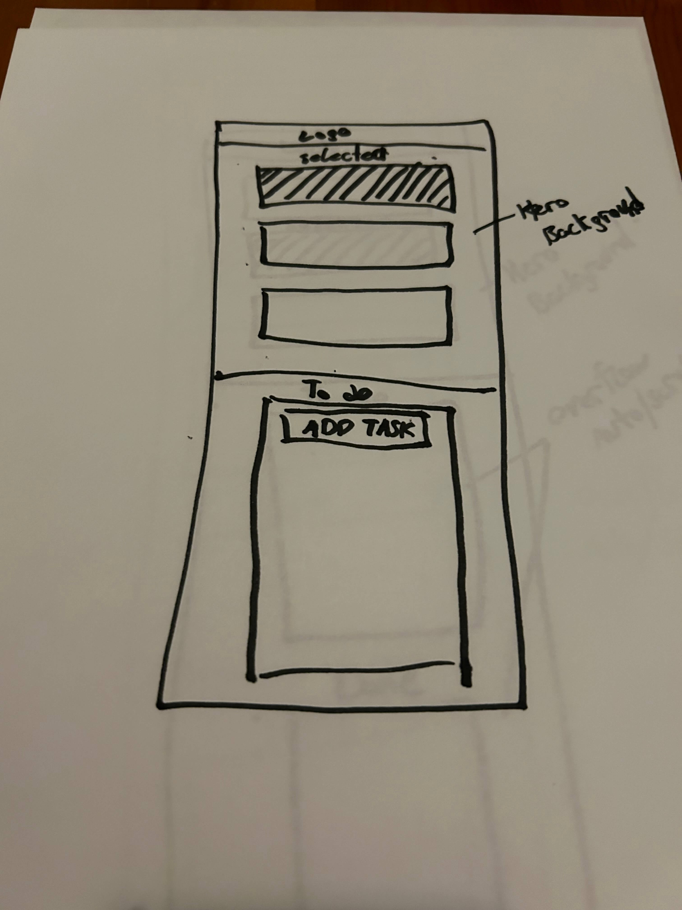
  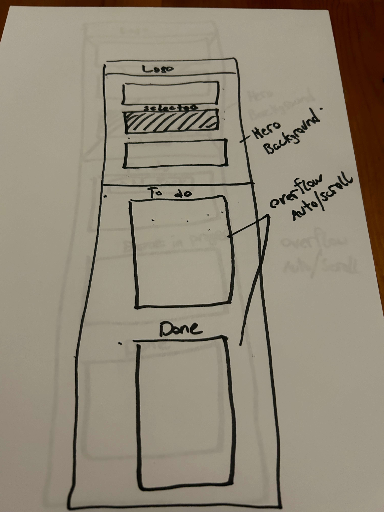
  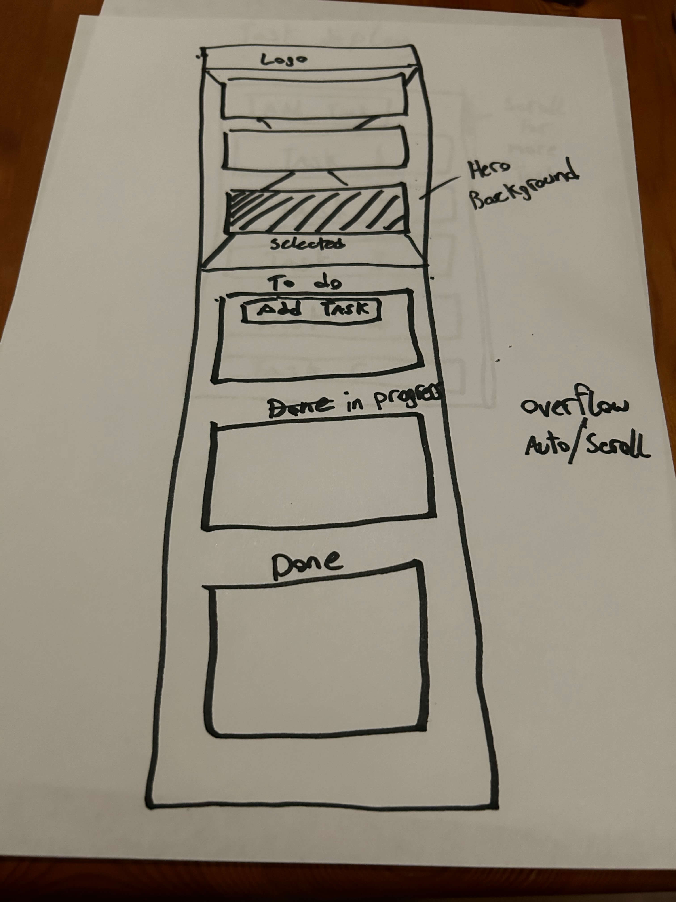

  
Task Layout

  
  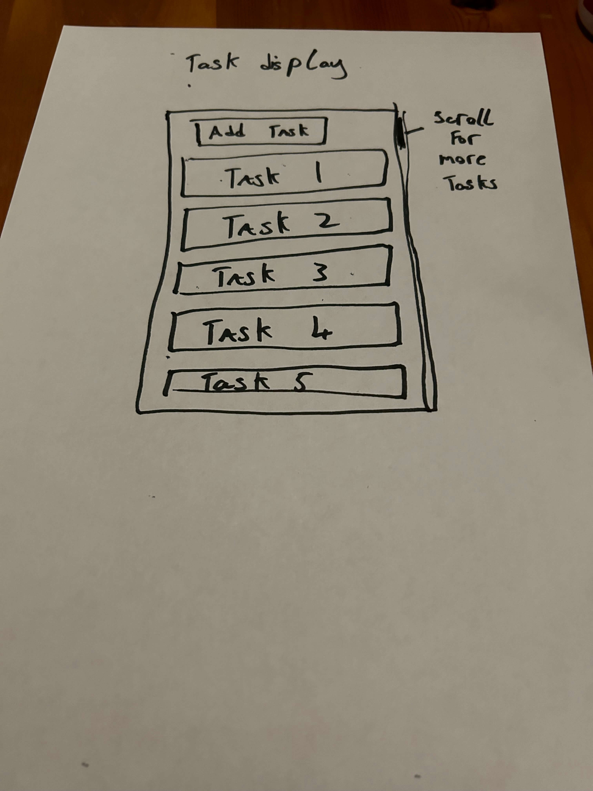

## Features 

### Navigation 
The Navigation bar is simplistic in design and only contains the logo for the website which is just the name "Simplify

### Langing page
-The landing page include an eye cathing hero image and cover text advising the user to choose their baord. 
-Underneath the cover text there are 3 equally sized boxes containing the number 1 to 3. 
-Upon click these boxes the user will be presented with a kanban board with the number of columns that aligns with the number in the box they clicked.

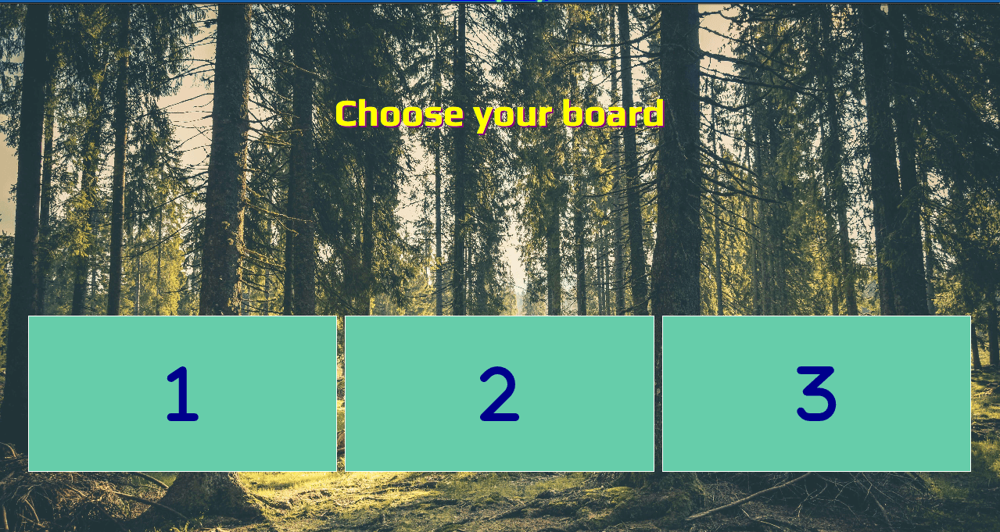

- As the user scrolls they are presented with a kanban board consisting of one column, two columns or three columns.
- At the top of each to do list there is a text input where the user can enter in the tasks they need to organize.
- each column is identical in size and appearence except for the the text input on the todo list.

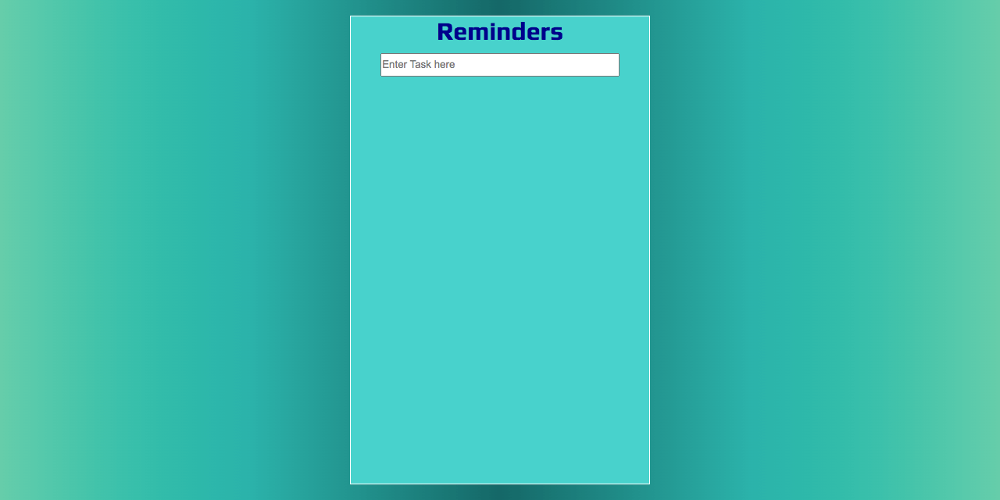

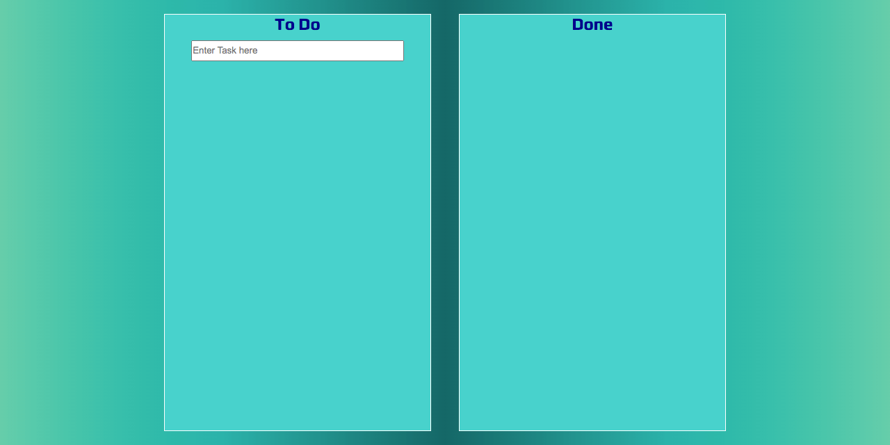

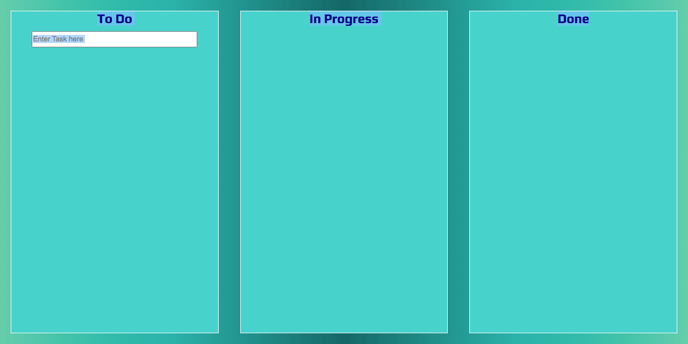

- To add a task the user selects the text input in the Reminders column on board one and the To Do column on boards two and three
- Once they hit enter the task is added to the Reminder column or To Do column
- Underneath the text content of the Task they user is also given three buttons, Edit, Delete and Move.

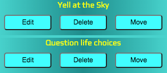

- When the delete button is selected, the user has to confirm that they wish to delete the task to which that delete button is assigned.

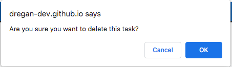

- When the Edit button is selected, the user is presented with an insterface to update the text of task to which the selected edit button is assigned.

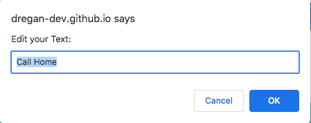
  
- When the Move button is selected on board two or three, the task is moved to the next subsequent column
- When it reaches the Done column, options to edit or move are removed from the users choices as those option could potentially cause confusion and errors to occur.

### Features left to implement
- Move backwards functionality between columns
- Save functionality so user can move between board types without information being deleted
- Differently designed boards

## Testing

### Validator Testing
-**HTML Validator**
-"Document checking completed. No errors or warnings to show."

-[W3C Validator Web Page Results](https://validator.w3.org/nu/?doc=https%3A%2F%2Fdregan-dev.github.io%2Fyou-kan-do-it%2F)

-**CSS Validator**
"Congratulations! No Error Found."
[CSS Validator Web Page Results](https://jigsaw.w3.org/css-validator/validator?uri=https%3A%2F%2Fdregan-dev.github.io%2Fyou-kan-do-it%2F&profile=css3svg&usermedium=all&warning=1&vextwarning=&lang=en)

-**JS Validator**
"20 Warnings, 0 Errors"
JS Hint

### Accessibility
This Site received a lighthouse rating of 100% accross the board. 
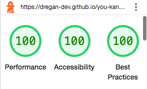

### Links Testing
All interactive elements of this website were tested manually to ensure correct functionality and no errors were reported.

### Browser Testing
The website was tested on Google Chrome, Firefox, Microsoft Edge and Sfari browsers with no issues noted.

### Friends and Family testing 
Friends and family were asked the review the site and documentation to point out any bugs and/or user experience issues.

### Known Bugs
Hero image can on occasion not load. Every effort has been taken to ensure that file path is correct. However the issue will occasionally occur. 

## Technologies Used

### Languages
-HTML5
-CSS
-JAVASCRIPT

### Frameworks - Libraries - Programs used
- [Responsinator](http://www.responsinator.com/) - Used to verify responsiveness of website on different devices.
- Pen and paper wireframes
- [Chrome Dev Tools](https://developer.chrome.com/docs/devtools/) - Used for overall development and tweaking, including testing responsiveness and performance.
- [Font Awesome](https://fontawesome.com/) - Used for Social Media icons in footer.
- [GitHub](https://github.com/) - Used for version control and hosting.
- [Google Fonts](https://fonts.google.com/) - Used to import and alter fonts on the page.
- [TinyPNG](https://tinypng.com/) - Used to compress images to reduce file size without a reduction in quality.
- [W3C](https://www.w3.org/) - Used for HTML & CSS Validation.
- [JS Hint](https://jshint.com/) - Used for JavaScript Validation.

## Deployment

The project was deployed using GitHub pages. The steps to deploy using GitHub pages are:

1. Go to the repository on GitHub.com
2. Select 'Settings' near the top of the page.
3. Select 'Pages' from the menu bar on the left of the page.
4. Under 'Source' select the 'Branch' dropdown menu and select the main branch.
5. Once selected, click the 'Save'.
6. Deployment should be confirmed by a message on a green background saying "Your site is published at" followed by the web address.

The live link can be found here - [Simplify](https://dregan-dev.github.io/you-kan-do-it/))

## Credits

### Content
-All of the content on this webpage was self generated except for the hero image. 

### Media
 The hero image used was gotten from the below website.
 -[Pexels](www.pexels.com/)

### Resources Used
General coding concepts for this project were researched using:
-[W3Schools](https://www.w3schools.com/)
-[Stack Overflow](https://stackoverflow.com/)
-The Add task function was adapted from code on this Stack Overflow thread [Stack Overflow](https://stackoverflow.com/questions/7060750/detect-the-enter-key-in-a-text-input-field)

## Acknowledgments
My mentor Antonio for being a pillar of support and fountain of sage advice. 

